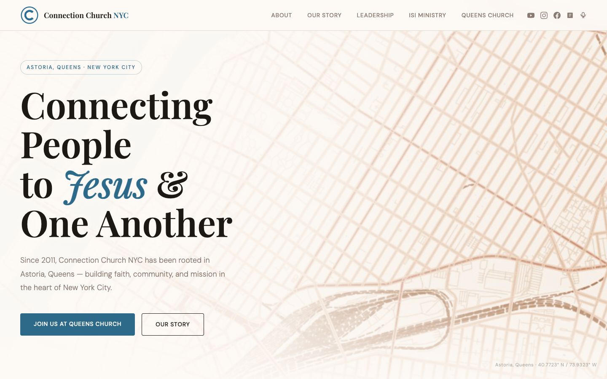

# Connection Church NYC

A legacy website for **Connection Church NYC** — a church rooted in Astoria, Queens from 2011 to 2024. Built as a polished static page honoring the community, mission, and story of Connection Church NYC, whose legacy continues through [Queens Church](https://www.qns.church).

---



---

## About

Connection Church NYC was founded in 2011 by the McGhee and Mayberry families in Astoria, Queens — one of the most diverse neighborhoods in the world. For over 13 years the church built lasting faith, community, and mission in the heart of New York City.

In 2024, Connection Church NYC officially merged with Queens Church, continuing the same mission under a new name.

This site serves as a permanent archive and tribute to that legacy.

---

## What's on the site

| Section | Description |
|---|---|
| **Hero** | Full-screen map of Astoria with the church's core message |
| **A Church for the City** | Who Connection Church NYC was and what it stood for |
| **Important Update** | The 2024 announcement of the merge with Queens Church |
| **Our Story** | A visual timeline from 2011 founding through 2024 |
| **Find Us at Queens Church** | Service times, address, and directions |
| **Social Media** | Links to YouTube, Instagram, Facebook, Blog, and Podcast |
| **Church Partners** | Organizations that supported the mission |
| **Leadership** | The Mayberrys, McGhees, and ISI Ministry team |
| **Footer** | Full archive links and legacy credit |

---

## Social & Media

- YouTube: [@connectionchurchnyc](https://www.youtube.com/@connectionchurchnyc)
- Instagram: [@connectionnyc](https://www.instagram.com/connectionnyc/)
- Facebook: [connectionnyc](https://www.facebook.com/connectionnyc/)
- Blog: [connectionnyc.blogspot.com](https://connectionnyc.blogspot.com/)
- Podcast: [Connection Church NYC Sermons](https://podcast.app/connection-church-nyc-sermons-p282311)

---

## Tech

- Pure HTML + CSS — no frameworks, no build tools, no dependencies
- All styling inline in `index.html`
- Responsive layout with mobile breakpoints
- SVG logo (`assets/logo-icon.svg`) for crisp rendering at any size
- Terracotta map of Astoria created with [terraink](https://github.com/bstef/terraink)

---

## Local preview

```bash
python3 -m http.server 8000
```

Then open `http://localhost:8000` — or just open `index.html` directly in your browser.

---

## File structure

```
connectionchurchnyc/
├── index.html                          # Main site
├── assets/
│   ├── logo-icon.svg                   # SVG church logo
│   ├── Website+Logo.png                # Full logo lockup
│   ├── astoria_terracotta_20260406_145101.png   # Astoria map (terraink)
│   └── screenshot-hero.png             # Site preview
└── archive/
    └── connection-church.html          # Archived alternate page
```
